# BillCore User Guide

> This guide uses demo data. Load it first: `make demo-data`

---

## Table of Contents

1. [Getting Started](#1-getting-started)
2. [Services & Tariffs](#2-services--tariffs)
3. [Clients](#3-clients)
4. [Locations](#4-locations)
5. [Subscriptions](#5-subscriptions)
6. [Billing Periods](#6-billing-periods)
7. [Calculations](#7-calculations)
8. [Statistics](#8-statistics)
9. [User Management](#9-user-management)

---

## 1. Getting Started

### Load demo data

```bash
make demo-data
```

This creates:
- **5 clients**: Alice Johnson, Bob Martinez, Carol Williams, David Chen, Emma Thompson
- **10 services**: Cold Water, Hot Water, Electricity, Natural Gas, Heating, and flat-rate services
- **3 billing periods**: January 2025 (closed/paid), February 2025 (closed/partial), March 2025 (open/pending)

### Sign in

Open [http://localhost:8080](http://localhost:8080) (or [http://localhost:3000](http://localhost:3000) in dev mode).

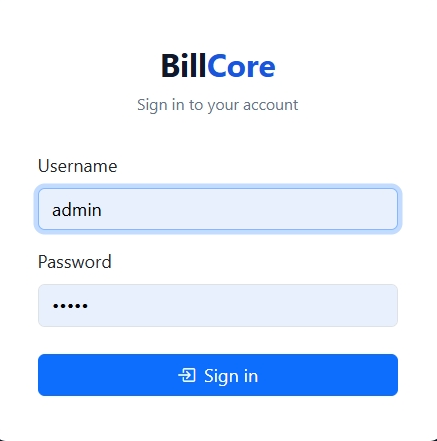

Default accounts:

| Username | Password | Role     | Default page |
|----------|----------|----------|--------------|
| admin    | admin    | Admin    | Users        |
| manager  | manager  | Manager  | Statistics   |

> Operators are created by admins — see [User Management](#9-user-management).

---

## 2. Services & Tariffs

**Navigation:** Management → Services

Services define what you bill for. Each service has a unit of measurement and a flag indicating whether it requires a meter reading.

### View services

After loading demo data you will see 10 services. The **Current tariff** column shows the active price per unit at a glance — no need to expand rows.

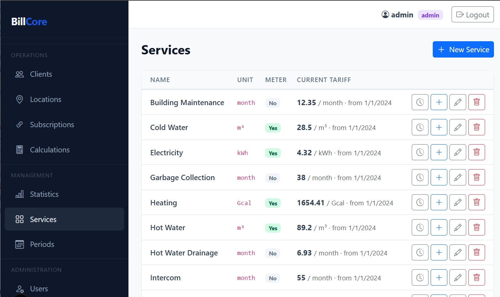

A red warning ⚠ **No active tariff** means calculations cannot be generated for that service until a tariff is added.

### Add a new service

1. Click **New Service**
2. Enter name and unit (e.g. `kWh`)
3. Check **Has meter** if subscribers submit readings each period
4. Check **Set initial tariff now** and enter the price
5. Click **Save**

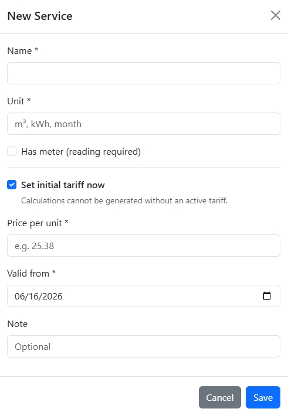

### Change a tariff

When a rate changes, do not edit the existing tariff — add a new one:

1. Click the 🕐 history button on the service row
2. Click **Add tariff**
3. Set the new price and **Valid from** date
4. Leave **Valid to** empty — this makes it the active tariff

The old tariff remains in history for audit purposes.

---

## 3. Clients

**Navigation:** Operations → Clients

### Search clients

Use the search box to find by name or account number. Partial matches work — type `ali` to find Alice Johnson.

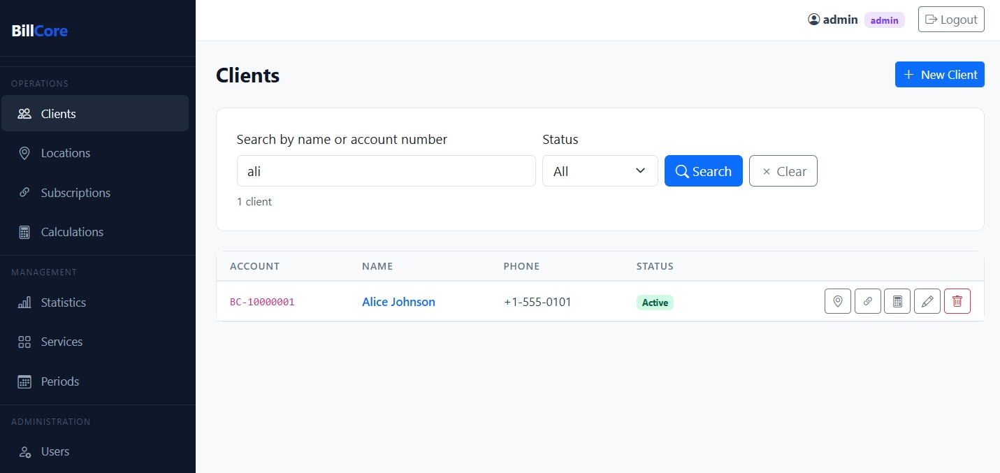

The list shows up to 20 clients by default. The counter shows `Showing 1–5 of 5 clients`.

### Quick access buttons

Each row has three shortcut buttons:

| Icon | Action |
|------|--------|
| 📍  | Jump to this client's Locations |
| 🔗  | Jump to this client's Subscriptions |
| 🧮  | Jump to this client's Calculations |

### Add a client

1. Click **New Client**
2. Fill in Full name (required)
3. Account number is auto-generated (`BC-XXXXXXXX`) — regenerate with ↻ or type your own
4. Add phone and email (optional)

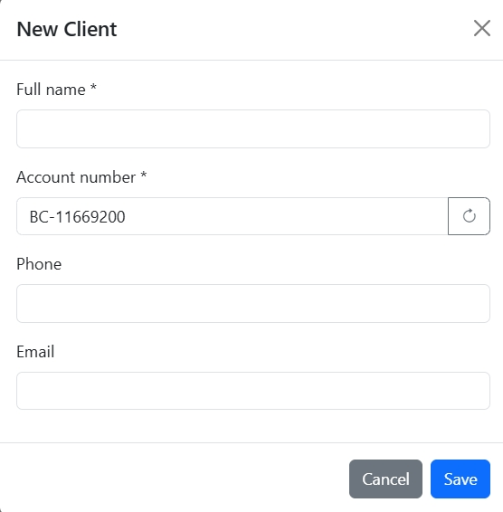

### Client detail page

Click a client's name to open their detail page. It shows:

- **Info** — account number, phone, email, status
- **Balance** — Pending (unpaid) vs Paid totals
- **Locations** — physical addresses
- **Subscriptions** — connected services per location
- **Pending calculations** — what is owed this period
- **Payment history** — all paid calculations

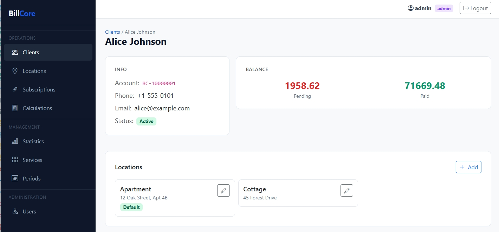
---

## 4. Locations

**Navigation:** Operations → Locations

A location is a physical address belonging to a client. Alice Johnson has two: her **Apartment** and a **Cottage**.

### View locations for a client

Select a client in the filter dropdown. Her locations appear in the table.

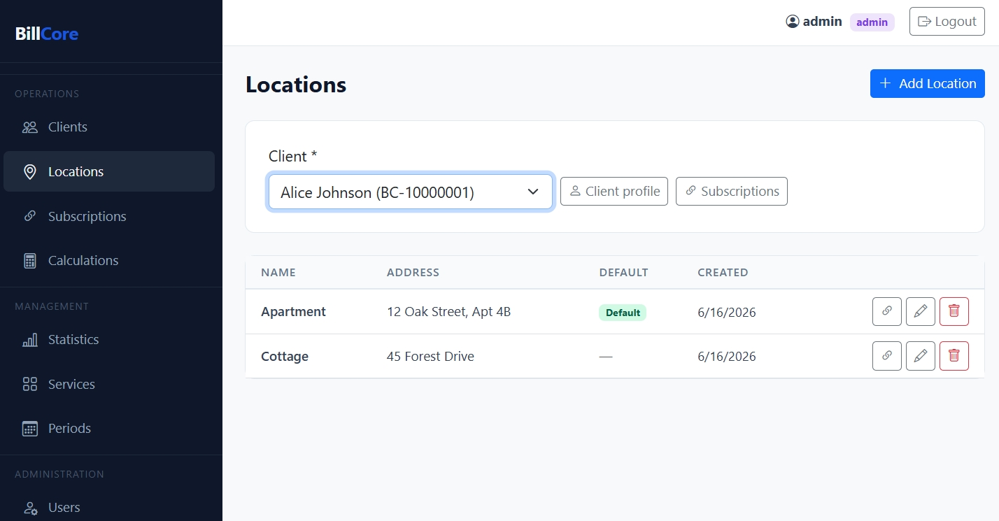

### Add a location

1. Select the client in the filter
2. Click **Add Location**
3. Enter a name (e.g. `Apartment`) and address
4. Optionally mark as **Default**

The modal title shows the client name: `Add Location — Alice Johnson`.

---

## 5. Subscriptions

**Navigation:** Operations → Subscriptions

A subscription connects a service to a client's location. Alice's Apartment is subscribed to all 10 services.

### View subscriptions

Filter by client, then optionally by location.

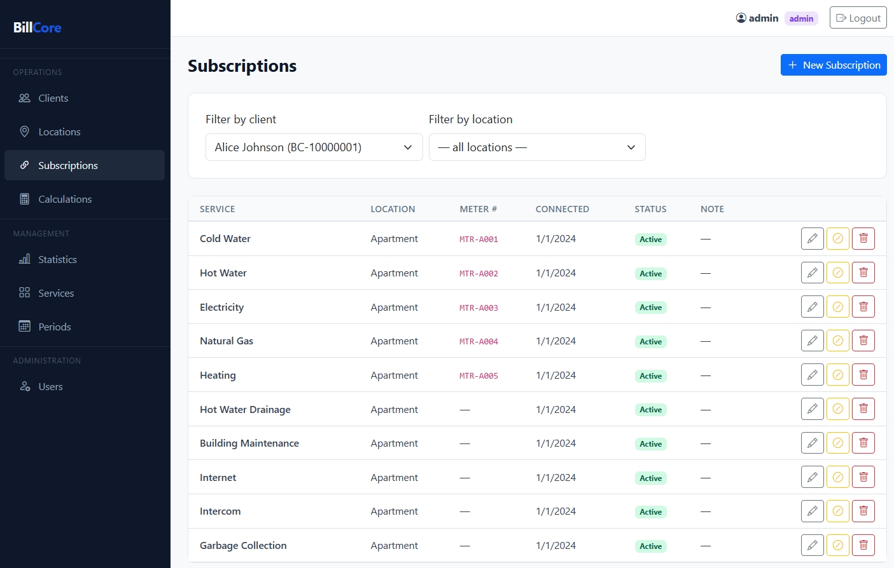

The **Status** column shows **Active** (green) or **Disconnected** (red with date).

### Subscribe a client to a service

1. Click **New Subscription**
2. Select the client and location
3. Select the service
4. Enter the meter number if applicable (e.g. `MTR-A001`)
5. Set the connected date

### Disconnect a subscription

Click 🚫 on the row and enter the disconnection date. The subscription stays in history but is excluded from future period generation.

---

## 6. Billing Periods

**Navigation:** Management → Periods

Periods represent billing months. The demo data has three:

| Period     | Status | Description                    |
|------------|--------|-------------------------------|
| Jan 2025   | 🔒 Closed | All calculations paid         |
| Feb 2025   | 🔒 Closed | Partial payments               |
| Mar 2025   | 🔓 Open   | Awaiting meter readings        |

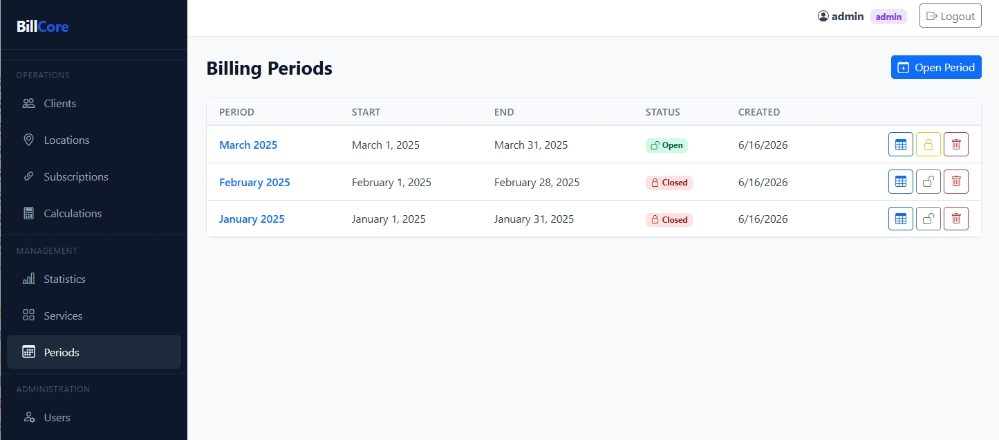

### Open a new period

1. Click **Open Period**
2. Select the first day of the billing month
3. Click **Open & Generate**

BillCore automatically creates calculations for all active subscriptions:
- **Flat-rate services** (Internet, Maintenance): amount is calculated immediately
- **Metered services** (Water, Electricity): previous reading is filled from the last period, current reading is left blank

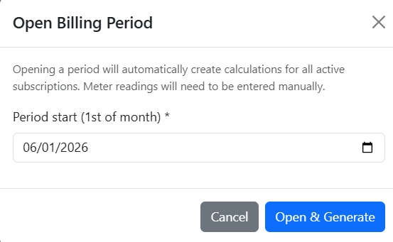

### Close a period

Click 🔒 **Close** when all readings are entered and the period is ready for invoicing. Closed periods are **locked** — calculations cannot be edited.

> You can reopen a closed period if needed by clicking 🔓.

---

## 7. Calculations

**Navigation:** Operations → Calculations

This is where operators work daily — entering meter readings and marking payments.

### Filter by period and client

The current open period is selected automatically. Filter by client and optionally by location.

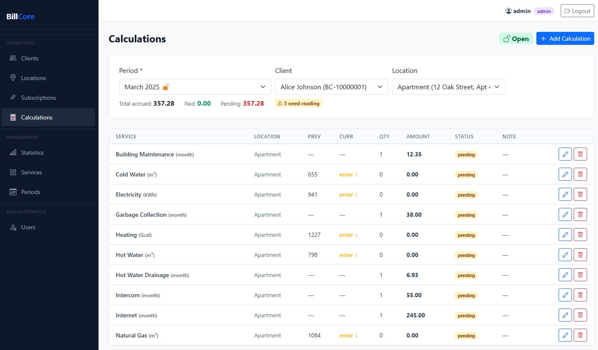

The summary row shows:
```
Total accrued: 357.28   Paid: 0.00   Pending: 357.28
```

An orange badge **⚠ 5 need reading** indicates how many metered services still need current readings.

### Enter a meter reading

1. Click ✏️ on a row with `enter ↓` in the **Curr** column
2. The modal shows the **Previous reading** (auto-filled)
3. Enter the **Current reading**
4. The **Quantity** is calculated live: `668 - 655 = 13 m³`
5. Click **Save** — amount is recalculated automatically

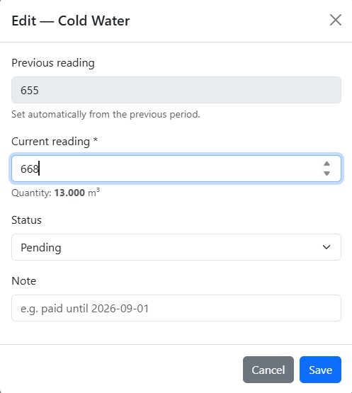

### Mark a calculation as paid

1. Click ✏️ on the row
2. Change **Status** to `Paid`
3. Click **Save**

For a closed period, click 💰 directly on the row.

### Add a manual calculation

If a subscription was added mid-period, click **Add Calculation**:

1. Select the subscription from the dropdown (already-calculated subscriptions are hidden)
2. For metered services: enter previous and current readings
3. For flat-rate: quantity defaults to 1
4. Click **Create**

---

## 8. Statistics

**Navigation:** Management → Statistics  
*(Available to Manager and Admin roles)*

The statistics page gives a real-time overview of the system.

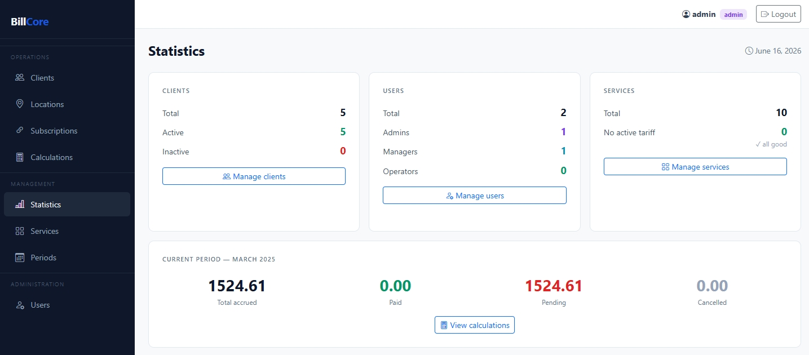

### Client card
- **Total** — all registered clients
- **Active / Inactive** — by status flag

### Users card
- Breakdown by role: Admins, Managers, Operators

### Services card
- **No active tariff** — highlighted in red if any service is missing a tariff (calculations would fail)

### Current period
- Shows the most recent period
- **Total accrued** — sum of all calculations
- **Paid** — sum of paid calculations
- **Pending** — sum awaiting payment
- **Cancelled** — written off

Click **View calculations** to jump directly to that period.

---

## 9. User Management

**Navigation:** Administration → Users  
*(Admin only)*

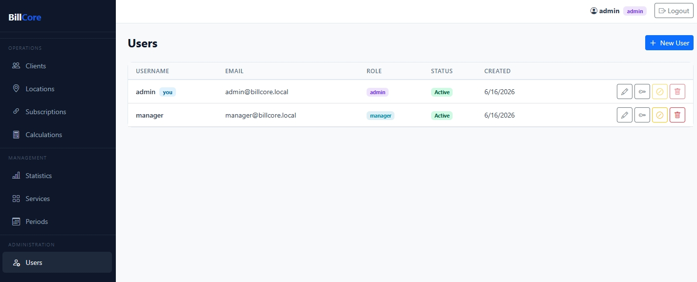

### Add a user

1. Click **New User**
2. Enter username, optional email, and password
3. Select role:
   - **Operator** — clients, locations, subscriptions, calculations
   - **Manager** — everything except user management
   - **Admin** — full access

### Block / Unblock

Click 🚫 to block a user (they cannot log in). The last active admin cannot be blocked.

### Change password

Click 🔑 on any user to set a new password.

### Delete

Click 🗑️ — only possible if the user has **no action history** in the system (no records they created or modified).

---

## Workflow summary

```
Admin/Manager:
  1. Add Services + Tariffs
  2. Open a billing Period

Operator (daily):
  1. Add Clients → Locations → Subscriptions
  2. Each month: enter meter readings in Calculations
  3. Mark calculations as Paid when payment received

Manager:
  4. Close period when all readings are entered
  5. Review Statistics
```
